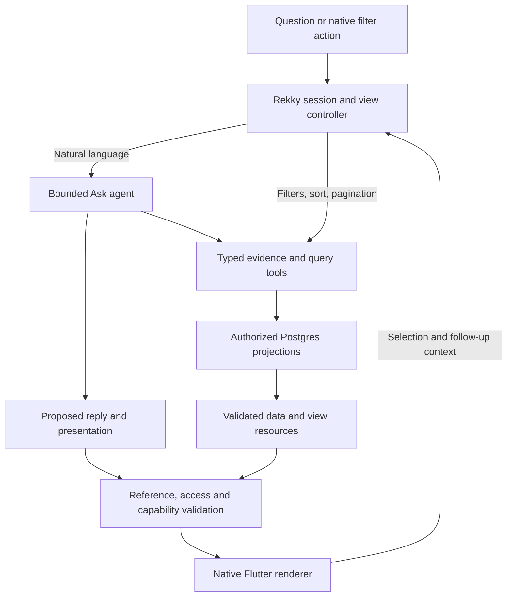

# Ask: conversation and exploration

Status: **own-library exploration pilot implemented; network and release gates pending**, 2026-09-28. This spec expands [the Ask experience plan](ASK_EXPERIENCE_PLAN.md) and [conversation repair](ASK_CONVERSATION_REPAIR.md). The [canonical product plan](REKKY_FLUTTER_PRODUCT_PLAN.md) owns product scope, access and release gates.

The pilot now has a continuous Ask conversation, a promptless Explore entry, agent-created collection views, deterministic owner-scoped filters/facets/counts/paging, an active-view handoff for asking about selected items, and stateless Responses tool continuation. It uses an ephemeral 15-minute view/session contract. `ask_ui.v1` has a shared fixture and Rust/Flutter readers. Direct browsing does not require a model call. The visible source label is deliberately **Your Library** because reciprocal friend access is not available yet. The full network explorer, grouped destination views with independent pages, streaming, durable history, held-out eval gate and scaled 1,000-item/device validation remain open checkpoints below; do not treat the pilot as the complete Ask release.

An explicit city in a saved location may supply a coarse city browse scope when the named neighbourhood is absent from the gazetteer; the neighbourhood remains unverified. A user's request *for* that unresolved neighbourhood must not silently become a city-wide collection. Native area facets send stable geographic IDs, while collection headings show readable place names.

Development validation: Rust owner-scope/paging/staleness and agent-view integration tests, geography rule-version and ambiguity tests, Flutter Ask and recommendation widget tests, Flutter analysis, and an Android device journey through promptless Explore → city filter → natural-language restaurant collection → two-item comparison → return to the preserved collection. The device run used the real local backend and existing saved account data. It does not establish the 1,000-item, multilingual, friend-revocation, iOS or latency gates.

## 1. Product decision

Ask is one destination with two connected surfaces: a continuous conversation and an explorable collection. The person can ask for a decision, browse without a prompt, or move between the two. Library remains the person's own space, including explicitly kept references when that feature ships. Network exploration lives in Ask; do not build a competing network browser inside Library or a fourth primary tab.

**Generate the useful view, not a new interface language every time.** The agent interprets the need, investigates accessible evidence, selects an appropriate composition and configures it. Flutter renders a small vocabulary of carefully designed native components. Rust owns access, queries, counts, pagination, revisions and actions. The model never generates Dart, HTML, SQL, arbitrary widgets, styling or executable expressions.

The memorable moment should be continuity: “Everything in Bangalore” becomes a browsable collection; “only restaurants” refines it; selecting two and asking “which for a date?” produces a comparison using those exact items. Nothing disappears, and returning to the collection restores the person's place.

### Intent drives scope and presentation

Collection views are available whenever they help the person's task. They are not activated by the literal words “all,” “everything,” a city name or any other keyword. Examples in this spec are evaluation scenarios, never category-specific routing rules. The agent infers the objective, useful breadth, source scope, geographic role, relevant categories and presentation from the utterance, conversation, active view and available evidence. It can combine a brief recommendation with an explorable matching set in the same reply.

| Natural request | Agent-directed response |
| --- | --- |
| “I'm looking for a bar to go to in Greater Kailash” | Resolve the neighbourhood and retrieve accessible bars there. Present a browsable matching collection, optionally highlighting supported fits; make every matching bar reachable without requiring “show all.” Do not silently include distant bars. |
| “I'm going to Goa—what information do we have?” | Explore destination-relevant saved knowledge across categories. Compose a Goa collection with populated groups such as stays, food, nightlife, activities and useful services/tips, derived from actual available evidence. Keep independent group counts/pages so restaurants cannot crowd out hotels or advice. Do not fabricate empty itinerary sections or narrow the trip to restaurants because they ranked highest. |
| “I'm looking for carpenters in Delhi” | Retrieve relevant service recommendations and supported Delhi coverage. Present comparable provider cards with attributed experience and authorized contacts. Keep uncertain coverage separate; a past job in Delhi does not establish present service coverage. |
| “Pick one of these bars for tonight” | Use the current collection/selections, inspect relevant evidence and offer a supported choice or concise comparison. Keep alternatives reachable; live opening/availability claims require current evidence. |

The model chooses useful group labels and maps each group to validated category/facet/location predicates or cited items through the existing view tool. Grouped exploration is a configuration of the collection component, not a bespoke Goa or travel screen. Groups share the active source/area scope and have independently accessible pages; counts state whether groups overlap. For a broad trip, include supported destination-related advice using its appropriate geographic role without presenting it as a physical venue or verified service coverage.

After a lookup, a single clear match needs only a card; an empty match needs an honest answer, never a zero-item collection. Multiple relevant options may warrant a browsable list; a broad destination may warrant grouped collections; a decision may warrant comparison. These are contextual choices, not mandatory screen-per-intent mappings. A one-item agent result stays direct even when the model tried to open a collection; the backend returns the item evidence but no view ID. A new collection is not the default for each question or follow-up. Create one only when exploring its matching set adds value; retain an active view when its scope still fits. Native Explore remains available for explicit browsing even when a filter leaves zero or one item. Ordinary option-seeking exposes the full relevant structured matching set alongside any highlights when that set is useful to browse. A subjective shortlist describes its selection criteria and coverage honestly. The user never needs special phrasing to unlock information.

## 2. Four demonstration journeys

These are acceptance scenarios, not claims about existing saved facts or counts.

| Journey | Intended experience |
| --- | --- |
| Explore without a prompt | Tap **Explore your network** on Ask home. Browse available cities, collections or people, with real counts. Choose Bengaluru, then restaurants, then one friend's contributions. Open the complete shared recommendation and return to the same position. |
| Turn a question into a collection | “Show me everything we have in Bangalore” opens an exhaustive, paginated collection inside Ask. It has a title, source/area filters, useful category shortcuts and a result count. “Only restaurants” changes the query; the earlier collection remains reachable from its conversation turn. |
| Move from exploring to deciding | Select two recommendations and ask “which would suit a quiet date?” Rekky compares the saved evidence, identifies unknowns and gives a supported conclusion if possible. Back returns to the same list, filters and selections. |
| Get a useful incomplete plan | “Food and an activity for a date” in Delhi receives supported dinner options plus a concise explanation of missing activity evidence. “Just food” retains Delhi/date context and removes the missing component. No repeated questionnaire or blank failure page. |

Retain the existing fuzzy-recall journey. A single driver lookup should still give a direct answer and contact action, not open an unnecessary collection explorer.

## 3. Experience and visual specification

### Ask home and the conversation

Keep the established neutral canvas, Fraunces/Manrope, blue Ask controls and the blue/red/yellow navigation capsule. Collection emblems retain their existing fixed colours. Do not introduce a second theme or colour whole conversation blocks blue.

Ask home has the inviting composer and a clearly visible Explore entry. With network enabled, use **Explore your network**; the explorer defaults to Friends from that entry, with Mine and Both available. In the own-only pilot, label it **Explore your saved recommendations** and default to Mine. Do not show pretend friend counts or imply network access already exists. With no accepted friends, offer a compact connection entry and useful own browsing.

The explorer landing surface can expose real populated cities, collections and people. Keep these out of a dense dashboard on Ask home. Do not require a model call to choose a collection or person. With no saved content, offer the established Recommend action without empty category tiles.

The conversation is a single scrollable timeline of restrained user utterances and editorial Rekky replies. A reply can contain a few relevant native objects; it is not a wall of cards or a succession of headings. Keep earlier turns visible, the composer reachable and fresh conversation/history in a secondary header control. Remove persistent previous-answer controls and the device-city chip. Use location implicitly for local discovery, with a secondary correction and natural-language override.

### The collection surface

A collection is a full-height route within Ask, not an enormous bottom sheet or a nested scrolling list in a chat message. It shares the main navigation and existing recommendation detail sheet. A turn contains a compact collection preview with server count and an **Explore** action. When the interpreted task is to explore options, the agent can open a validated collection even without “all” or “everything”; when a direct answer is more useful, it can embed results and a collection preview. Choose this presentation from intent and context, not keyword matching. An explicit tap on Explore opens it immediately. Do not navigate automatically after the user has left the requesting turn or begun another action.

Layout, top to bottom:

1. Back to conversation, a concise title and count; no duplicated page title above them.
2. A readable scope row: area, Mine/Friends/Both and optional selected friend. These are visible here because they control browsing. Area remains Everywhere for unscoped browsing; device city must not silently hide the rest of the network.
3. Useful collection/category shortcuts and one filter entry for less common facets. Facets are server-derived from the accessible matching set. Source/person/location do not require a perfect prompt. Natural Ask defaults to Both once network access is enabled, unless the person specifies another scope or an active collection supplies it; the explicit Explore your network entry starts in Friends.
4. Compact native cards: subject, specific category, locality, author, rating with provenance where present, and a useful destination. Summaries open on detail. Reuse Library card anatomy but retain author identity for shared items.
5. An optional **Ask about these** composer/action. Its context is the current query and explicit selections, not merely the rows currently loaded. Keep it above the primary navigation and clear of list content and the keyboard.

Exact filters and semantic preferences look distinct: Delhi/restaurants/Rahul are query constraints; “quiet” and “good for a date” are suitability interpretations with evidence gaps. `open_collection.query` matches only literal subject/category text; it cannot filter saved evidence for quietness. Filtering by a subjective property cannot claim an exhaustive factual result unless an indexed, defined predicate supports it. An unsupported subjective refinement may produce a cited shortlist within an existing collection and retain **View all**; it must not title a broad restaurant collection “quiet places” as if quietness were verified. A follow-up that broadens “quiet dinner” to “dinner spots” drops the quietness constraint while retaining the city and dinner context.

Use `saved_newest` (server save time), `name` and optional `rating` as initial sort values; rating retains its provenance and missing scores sort last. Browse defaults to saved-newest; relevance belongs to a query/shortlist, and an estimated score is never a universal “best” sort. Use stable category and location identities, not phrase fragments or geographic alias chips. Unknown locations remain separately reachable; they do not enter a confirmed local count. For services, current service coverage and past-experience location stay separate. Multiple recommendations about the same venue retain separate authors; only confirmed entity identity can support optional grouping, and its count must distinguish recommendations from unique places.

### Small details that provide the polish

- The same recommendation identity, icon, colour and action positions carry from preview to collection to detail. Comparison uses matching dimensions with concise, source-backed cells.
- One natural sentence can introduce the result; avoid “I found useful connections,” “Your experience” and repeated explanatory headings.
- A brief transition connects preview and collection; preserve stable keys and scroll anchors. Use the existing motion tokens, roughly 180–240 ms, and reduced-motion alternatives. No typewriter delay, bouncing cards or animated count-up.
- A submitted utterance appears immediately. Use one quiet in-thread work indicator driven by real state. Keep earlier content usable; no fullscreen spinner or fake reasoning narration.
- Render validated data as it arrives. Once touched, a card stays in place until the user refreshes or deliberately changes scope. An explicit filter change can replace the list, with the changed scope shown immediately.
- Touch targets at least 48 logical pixels; support screen-reader reading order, 200% text, portrait safe areas, keyboard and existing haptics. Validate narrow widths and long multilingual names. Do not add haptics for streamed content.

## 4. Architecture and ownership



Use one Rust service, Postgres and one bounded agent. Keep the configured `gpt-6-luna`; this change does not authorize a model migration. No agent per category, no orchestration framework migration and no extra model call just to style a response.

Two separate contracts prevent model output from becoming application authority:

- **Presentation proposal:** model-selected component types, evidence references, short prose and view references returned by tools. The model can request a view through a typed tool but cannot manufacture result counts, ownership, cursors or destinations.
- **Resolved view manifest:** backend-produced resources, hydrated authorized items, current revisions, exact/unknown counts, valid actions and renderer capabilities. The Flutter client renders only this validated contract.

Tools return compact evidence for decisions plus opaque query/view references. Large collections remain in Postgres and on paginated client surfaces, never in the model context. Tool outputs and saved recommendations are untrusted data, not agent instructions.

### Initial agent capabilities

| Tool | Inputs and useful output |
| --- | --- |
| `knowledge_overview` | Authorized source/area scope; available collection/category counts, known/unknown location coverage and bounded evidence-backed capability summaries. Must report incomplete projections. This is the repair plan's `library_overview`, renamed for future shared knowledge. |
| `resolve_area` | Place expression or coarse device locality plus provenance/granularity; canonical area or ambiguity. Geographic relationships stay in the resolver. No growing prompt list of aliases. |
| `search_knowledge` | Structured predicates plus lexical/semantic clues; ranked evidence references, match/unknown status and continuation. Used for recall and choosing. |
| `open_collection` | Typed exhaustive predicates, grouping and allowed sort; server-created query/view reference, facets, count and first page. Used for browsing all matching recommendations. |
| `inspect_evidence` | Bounded item/revision references; authorized shared facts, caveats and provenance. |
| `present_answer` | Short reply, supported claims, approved blocks, missing parts and at most one useful clarification. Terminates the current decision loop. |

Keep strict function schemas and normal Responses tool continuation: preserve replayable response items, return tool results with their call IDs, and continue within the same bounded turn. Retain `store:false` with private Rekky-managed state. The terminal `present_answer` call is the structured presentation proposal; do not add a mandatory separate formatter call. Schema adherence cannot establish factual correctness: access, references and meaningful evidence checks remain application responsibilities.

## 5. Native component vocabulary and wire contract

Start with five block types. Each has one native implementation and a capability version; the agent composes these across all recommendation categories.

| Block | Contract and constraint |
| --- | --- |
| `recommendation_set` | Ordered cited item references; compact or featured-first density. Server hydrates facts/actions. A curated shortlist, with a related collection link when applicable. |
| `collection_preview` | Validated view reference, short title and server count/preview. Opens the full collection route; never embeds hundreds of rows. |
| `comparison` | Two to four item references, common dimensions, cited cells, unknowns and optional supported conclusion. Reuse the comparison pilot. |
| `choice` | One meaningful question and a small bounded set of reply intents, backed by available evidence. Always permits free text. |
| `gap` | A missing component or unsupported constraint and an allowed next step. May be inline text; it is not a warning panel by default. |

A conversational reply is ordinary text with evidence-linked claim spans, not another decorative card. Detail, maps and contact actions are native routes attached to authorized items. Optional maps, multi-part occasion boards, saved collections and public results follow later; their capability is absent until implemented.

Proposed protocol version: `ask_ui.v1`, separate from current answer fixtures. Agree executable JSON schemas and shared Rust/Dart fixtures in the first slice; this document describes the contract, not a deployed API.

| Type | Required information |
| --- | --- |
| `TurnRequest` | Idempotency key, session ID, expected session version, utterance, view ID/revision if active, selected/excluded item IDs, supported component capabilities. Device scope is separate from explicit area, with source and freshness. |
| `TurnState` | Objective, topic, hard constraints and provenance, soft preferences, source scope, active query, selections, unresolved questions, recent user/assistant turns and current evidence references. No hidden chain-of-thought. |
| `Reply` | Stable message/turn IDs, status, brief text and cited claims, ordered blocks, missing parts, view references and revision. |
| `BrowseSpec` | Mine/Friends/Both, authorized author IDs, canonical area/granularity/location role, category/facet IDs, optional literal query, allowlisted sort/grouping and unknown-location policy. No arbitrary predicates or SQL. |
| `ViewResource` | Opaque ID, owner, revision, canonical BrowseSpec, query fingerprint, data/projection/access generation, count kind, total when known, facets, first page and signed/opaque continuation. |
| `ViewAction` | Typed action, target view/revision and arguments: set/remove filter, sort, next page, open item, select items or ask about view. No arbitrary URL execution. |

Illustrative presentation proposal (symbolic references, not fabricated live data):

```json
{
  "schema_version": "ask_ui.v1",
  "reply": "Here is the collection. You can narrow it by neighbourhood or person.",
  "blocks": [
    {"id": "collection-1", "type": "collection_preview", "view_ref": "view-returned-by-tool"}
  ],
  "missing_parts": []
}
```

The backend adds the real count and actual items. Unsupported blocks downgrade to a supported list or concise reply. Preserve valid independent blocks when one block is malformed; one bounded repair may run within the same budget. Reject invalid destinations and access violations, but harmless wording does not invalidate the entire response. Never silently drop the only requested collection: return a usable list fallback or explicit retry.

### Proposed API surface

Keep existing `/v1/ask` clients compatible; introduce these resources under an explicit `/v1/ask-ui` contract namespace. Final schemas and routes are locked with fixtures before implementation.

| Route | Responsibility |
| --- | --- |
| `POST /v1/ask-ui/sessions` | Create an account-bound ephemeral session; no model call. |
| `POST /v1/ask-ui/sessions/{id}/turns` | Submit idempotent natural-language turn with expected session/view versions; return 202 receipt. |
| `GET /v1/ask-ui/turns/{id}` and `/events` | Authorized receipt and resumable event stream; current-access validation applies on replay. |
| `POST /v1/ask-ui/turns/{id}/cancel` | Idempotently cancel remaining work without duplicating a provider request. |
| `POST /v1/ask-ui/views` | Create a deterministic collection from a typed BrowseSpec, including direct Explore/filter actions. |
| `GET /v1/ask-ui/views/{id}` and `/items?cursor=…` | Revalidated metadata/facets and pages; an expired or invalidated view returns a typed recovery code. |
| `DELETE /v1/ask-ui/sessions/{id}` | Delete private session/view resources and stop unfinished work; cannot delete saved recommendations. |

Agent `open_collection` and native view creation use the same internal query service. New filters produce a new query revision/resource instead of mutating old cursors. Item detail continues through an independently authorized item endpoint; no requirement to populate the personal Library first. Session/view ownership is checked for every route, not inferred from opaque IDs.

## 6. Browsing correctness and network boundary

**Browse is exhaustive within explicit predicates; recommendation is selective.** `open_collection` must query the full authorized set independently of the agent's candidate window, tool budget and semantic top-k. All qualifying items are reachable through stable pagination. “Everything” cannot mean “everything the model inspected.” Count is server-computed; if the query cannot complete, report unavailable/partial state, not zero. Embedding failure must not prevent category/city/person browsing.

Use one reusable authorization scope for overview, facets, counts, search, page reads, details, actions, comparisons and reopened history. Mine means owner-created items; Friends means current reciprocal friends' eligible Friends items; Both is their union. Author filters cannot bypass source scope. A kept reference must not duplicate an item in Both. Friends visibility alone never grants access before a reciprocal relationship exists.

Friendship access is **not implemented in the current Ask pilot**. Ship the own-only internal vertical slice first with the same contracts. The network promise requires F-03 reciprocal relationships, appropriate blocking/removal semantics and release safeguards; do not mark the feature complete on owner-only data. Shared detail has Library-level granularity for authorized recommendation content: summary, observations/caveats, category, location, rating, author and attached contact according to item audience. Raw transcripts, private captures and device contacts never enter network tools or views.

For facets, use disjunctive counts: apply all other active dimensions while calculating alternatives within one dimension. Keep zero-match selected filters visible so they can be removed; do not show zero-count private alternatives. Counts describe recommendations, not people or entities unless explicitly labelled otherwise.

Page size initially 20, bounded server-side. Use a stable sort with item ID as tie-breaker and a query snapshot/continuation bound to account, predicates, access generation and data revision. Do not hold a database transaction open across phone requests. Additions can wait for refresh; edits or permission changes invalidate/rebuild the view, while each page/detail rechecks current access. Use a typed `view_stale` recovery to refresh safely and preserve the nearest surviving scroll anchor. Never promise a frozen result set at the expense of showing revoked content.

Geography needs a resolver/index fix before local browse acceptance: New Delhi device locality and Delhi/Connaught Place venues must share a supported metropolitan scope, while explicit Indiranagar remains neighbourhood-specific. Preserve canonical memberships and service-area roles on the server; do not use the LLM as a geographic access/filter engine. Broad city identity must not imply that an entire state or all NCR is nearby. Test boundaries and retain ambiguity instead of guessing.

## 7. Conversation and view state

Keep three distinct state layers:

- Session: effective request and recent conversation, including assistant clarifications and gaps.
- Server view: query and revision, authoritative pagination and access checks.
- Local presentation: scroll anchor, expanded detail, draft text and selected items.

Opening a collection is not creating a saved collection or changing the user's Library. Filters, sorting, paging and opening detail call deterministic APIs with **zero model calls**. They update the active query revision; the next natural-language request includes that revision. Do not fill the transcript with a chat message for every tap. A small current-view reference supplies context when the person returns to conversation.

Natural-language refinements produce a new reply and a new view revision; old turns retain labelled earlier-scope references. Back restores the most recently used local view state; reopening an older turn uses its historical filter specification revalidated against current data. Explicit selections override vague visual proximity. “These” means selected IDs, or the active collection when no items are selected; clarify if a comparison target remains ambiguous. “Best of these” must investigate the active query beyond the first loaded page or explicitly describe its limited coverage.

Use optimistic version checks on session/view updates. A late turn cannot overwrite a newer filter, navigate the user away or resurrect a revoked result. Return conflicts with a recoverable state, not a silent last-write-wins overwrite. Remember independent Ask and Library navigation positions.

Do not silently extend current 15-minute pilot retention. First internal slice remains ephemeral and says when an expired session needs restarting. Durable 30-day private history remains ASK-4, with expiry/deletion/account-deletion jobs and later sync gates. Derived prose, counts and comparisons can themselves disclose friend content: tag their dependencies and redact/rebuild them when access changes, not merely remove the card. Reopened history is reauthorized before display; do not replay stale friend prose to the model. Network browsing initially requires online revalidation; offline shared history is unavailable until its privacy contract is implemented.

## 8. Streaming, failure and performance

Use a persisted turn receipt plus an authenticated event stream for the new contract. Proposed native transport: POST to start an idempotent turn, authenticated streamed GET for events, and GET receipt as reconnect/poll fallback. No auth tokens in URLs. SSE frames need bounded decoding, event IDs and replay/deduplication on Flutter; measure this before removing the existing polling path.

Events: `turn.accepted`, `work.stage`, `view.ready`, `block.committed`, `turn.completed`, `turn.failed`, `turn.cancelled`. Include session/turn/version and event sequence. Only a validated complete block becomes actionable; never render partial JSON/tool arguments or unverified model text as trusted advice. Future text streaming must commit validated sentence/claim chunks; do not simulate streaming with delayed letters. Minimize validation overhead by streaming data views before optional prose.

A failed narrative leaves usable authorized collection results. A failed collection request keeps existing rows plus retry. No matches, missing evidence, access removed, expired view and provider failure are distinct states. An error must never become “your Library is empty.” Cancellation/reconnect cannot duplicate paid calls or user writes. Preserve quota/spend/deadline limits from the Ask plan, and account for presentation repair calls within them.

Proposed performance goals on a declared test device/network: interaction acknowledgement under 100 ms; deterministic first page/filter p95 under 1 s; first usable nuanced view p95 under 3 s; ordinary completed answer p95 under 5 s. These are targets, not current measurements. Measure cold/warm cases and large authorized datasets separately. Cache only by account, scope, predicates, data/access generation and schema version. No model call on each scroll or unchanged view opening.

Record content-free stage/error codes, candidate and page counts, token/byte usage, decisions, retries and timings. Do not log questions, contact numbers, raw recommendation text or coordinate history. Separate retrieval failure, incomplete coverage and synthesis failure in diagnostics.

## 9. Implementation map and delivery order

Use the existing code; extract responsibilities incrementally instead of replacing the entire Ask implementation. Exact module names below are proposed ownership boundaries.

| Layer | Planned files/responsibilities |
| --- | --- |
| Contracts | `contracts/rekky/v1/fixtures/ask_ui.json` and matching schema: happy paths, browse/shortlist distinction, unknown blocks, partial/error states, stale views, revocation, multilingual and large-text content. Consume identical fixtures in Rust and Dart. |
| Rust agent | `src/ask.rs`, `prompts/ask_v1.txt`; extract `ask_session.rs` and `ask_ui.rs` for turn state/manifest validation. Add real tool continuation, coverage, natural reply and partial gaps. |
| Rust data | New `knowledge_query.rs` and `ask_views.rs`; reuse existing taxonomy, geographic and item projections, with one access-scoped query implementation. Wire versioned routes in `src/app.rs` and add migrations for view/turn resources and expiry. |
| Flutter | `ask_experience.dart` becomes route/session coordinator; add typed `ask_ui.dart`, `ask_thread.dart`, `ask_explorer.dart` and `ask_view_controller.dart`. Adapt `rekky_api.dart`, reuse comparison/detail/card/filter/theme primitives without requiring Library to have loaded the item. |
| Checks | Backend unit/integration authorization and pagination cases; shared contract tests; Flutter reducer/widget/navigation/accessibility checks; whole-journey held-out evals and real-device sessions. |

Implementation checkpoints refine ASK-0–7; they do not create a competing product phase system:

1. **Contracts and reliability foundation (ASK-0/1 repair).** Lock shared fixtures, distinguish browse from choose, add diagnostic errors, repair metropolitan scope and define a reusable permission-scoped query. Gate: Delhi regression and deterministic browse contract pass against a real test database.
2. **Own-data exploration end to end (ASK-1 extension).** Explore entry, full collection route, counts/facets, direct filters/pagination, rich detail and preserved navigation. Gate: exhaustive fixture collections of 0/1/100/1,000 items paginate without omissions/duplicates; no AI for direct interactions.
3. **Continuous conversation plus generated views (ASK-1/2).** Structured effective request, coverage tool, Responses continuation, natural replies, approved blocks and scoped view references; failure stays inside its turn. Gate: everything → filter → compare → back works, as does date → food+activity → food.
4. **Progressive results and composition polish (ASK-2/3).** Turn event transport, graceful partial rendering, reference continuity and current comparison reuse. Gate: cancellation, reconnect, out-of-order events, text scaling and keyboard work on device; measured latency reported.
5. **Real network exploration (ASK-6/F-03).** Reciprocal friend authorization, sources/people facets, shared detail and derived-answer revocation. Gate: multiple-account DB tests and controlled device sessions; all shared-access and external pilot safeguards pass. Owner-only demos cannot close this gate.
6. **Resume and richer outcomes (ASK-4/5/7).** Durable history/saved query or selected-reference collections, explicit preferences, optional geographic/composed views and separately labelled public tools, each under its existing dependencies. No speculative itinerary facts or automatic endorsement creation.

First convincing demonstration: on one phone, open a complete Bengaluru collection, narrow it by restaurant/neighbourhood, choose two, ask a contextual comparison and return to the exact list position. Then repeat with two accepted friends and permission removal once the network slice is available. Both must use the real backend; seed/demo data is explicitly identified.

## 10. Release evidence

Extend the existing 120-query, English/Hindi/Hinglish evaluation rather than replacing it with a handful of attractive demos. Separate deterministic browse correctness from subjective recommendation quality.

- **Completeness:** 100% of authorized fixture items satisfying deterministic predicates are reachable; counts/facets reconcile with database truth. No candidate-budget/top-k truncation. Unknown-location policy is explicit.
- **Intent generalization:** bars in Greater Kailash, trip information for Goa and carpenters in Delhi work without “all/everything.” Test unseen categories/destinations and English/Hindi/Hinglish paraphrases, including the same wording in different conversation contexts. Verify appropriate geographic roles, group coverage and no category-specific routing tables.
- **Conversation:** every scripted refinement preserves or deliberately updates objective, source and explicit location; selected references remain stable. Broad unavailable-category questions and stale-turn replacement fail the gate.
- **Privacy:** zero unauthorized results, counts, facets, detail fields, contact actions or derived prose in the adversarial suite. Include friend removal/block, audience changes during pagination, stale history, crafted IDs and source prompt injection.
- **Resilience:** malformed/unsupported blocks preserve usable alternatives; refusal, timeout, quota, disconnect and empty data produce different recoverable states. No valid empty Library claim from a provider failure.
- **Interaction:** promptless exploration, browse-to-compare and return-to-position work without coaching. Reuse the 8-of-10 formative task-completion target; record failures/time, not just satisfaction. “Wow” must accompany task success, not substitute for it.
- **Efficiency:** zero model calls for ordinary filters/pages/detail; trace meaningful agent continuation, cost and p50/p95 time to useful content. Test scaled datasets and both platform layouts; current Android validation cannot establish iOS behavior.

## 11. Basis for the implementation choice

Official OpenAI documentation distinguishes typed tool calls for application capabilities from structured response formats for presentation. Rekky uses strict tools for retrieval/view creation and its terminal presentation proposal; a native manifest keeps rendering deterministic. [Structured Outputs](https://developers.openai.com/api/docs/guides/structured-outputs).

Tool responses must remain associated with their calls, and the model can continue from their observed results. This supports the bounded loop instead of restarting every step as a new independent JSON prompt. [Function calling](https://developers.openai.com/api/docs/guides/function-calling).

Manual conversation state supports replaying response items while using `store:false`. Rekky retains ownership of its private session lifecycle; provider-managed durable conversations are not required for this design. [Conversation state](https://developers.openai.com/api/docs/guides/conversation-state).

The component vocabulary, UI flow, query resources and release sequence above are Rekky-specific engineering decisions, not claims that an OpenAI framework supplies a ready-made Flutter generative UI.
